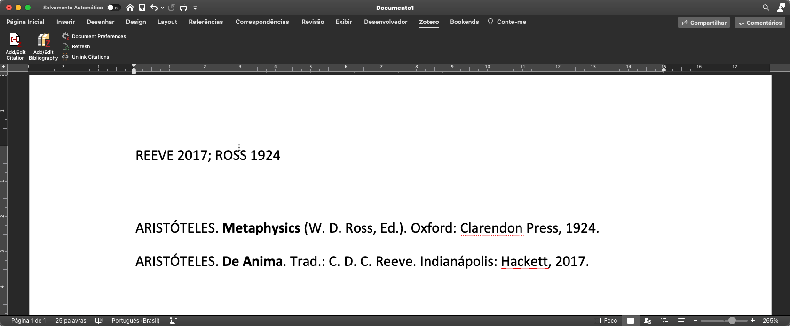

# CSL ABNT para Autores Antigos

Esse é um estilo que adaptei para facilitar a citação de textos antigos utilizando o Zotero. 

- Para citar a ed. Bekker (ed. crítica de referência que contém a numeração a a partir da qual o texto de Aristóteles é citado), utilizo o tipo **chapter**.
- Para citar as demais edições críticas, utilizo o tipo **conference paper**.
- Para citar traduções modernas, utilizo o tipo **report**.

